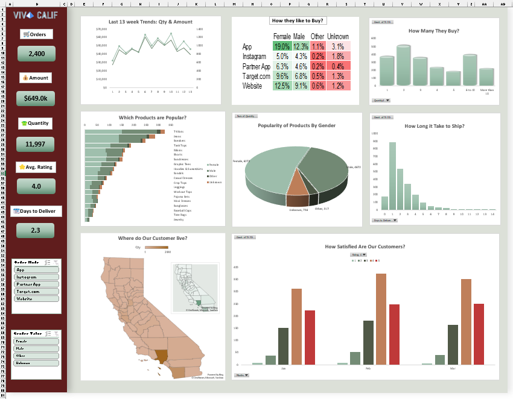

# 📊 Sales Analytics Dashboard (Excel)

## 🔍 Overview  
This project showcases an **interactive Sales Dashboard built in Microsoft Excel** to analyze business performance, customer behavior, and operational efficiency.  

It transforms raw sales data into **clear, actionable insights** through visualizations and KPIs.

---

## 📁 Project Files  
- `ecommerce-blank.xlsx` → Main interactive dashboard  
- `Dashboard3a.png` → Dashboard preview image
- `Dashboard3b.png` → Dashboard preview image  

---

## 📌 Key KPIs  
- Total Orders  
- Total Quantity  
- Total Amount  
- Average Rating  
- Average Days to Deliver  

---

## 📈 Dashboard Features  

### 🔹 Sales Trends  
- 13-week trend analysis of **sales quantity and revenue**

### 🔹 Customer Purchase Behavior  
- Buying channels (App, Instagram, Website, etc.)  
- Purchase quantity distribution  

### 🔹 Product Analysis  
- Identification of **top-performing products**  

### 🔹 Customer Demographics  
- Gender-based purchasing insights  

### 🔹 Geographic Insights  
- Customer distribution by location  

### 🔹 Logistics Performance  
- Delivery time analysis  

### 🔹 Customer Satisfaction  
- Monthly rating trends  

---

## 💡 Key Insights  
- Sales trends show **fluctuations**, indicating seasonal or campaign-driven demand  
- Customers prefer specific platforms, helping guide marketing strategies  
- A small group of products contributes to the majority of sales  
- Faster delivery times are linked to better customer satisfaction  
- Ratings are generally positive with opportunities for improvement  

---

## 🛠 Tools & Skills Used  
- Microsoft Excel  
- Pivot Tables & Pivot Charts  
- Data Cleaning & Transformation  
- Dashboard Design  
- Data Analysis & Visualization  

---

## 🎯 Learning Outcome  
- Built a complete **end-to-end dashboard in Excel**  
- Improved ability to analyze and interpret business data  
- Developed skills in presenting insights visually  

---

## 📸 Dashboard Preview  

---

## 📚 Reference  
This project was inspired by the following tutorial:  
https://www.youtube.com/watch?v=l5qkg8gzY6E&t=1084s  

---

## 🚀 Future Improvements  
- Integrate SQL for data extraction  
- Develop a Power BI version  
- Add automated data updates  

---

## 👨‍💻 Author  
**Samiha Jahan Ema**
